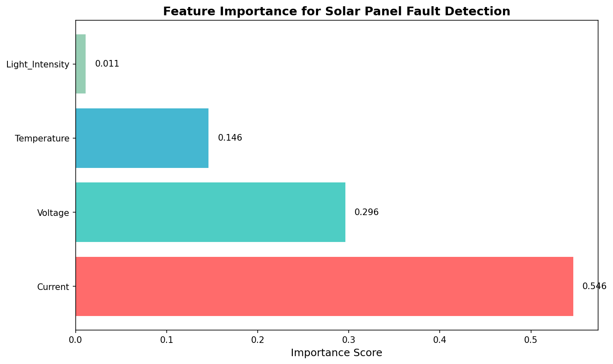

# ☀️ Solar Panel Fault Detection System

An AI-powered fault detection system for solar panels using **Random Forest machine learning**, with support for real hardware (ESP32/Arduino) and a beautiful **Next.js web dashboard**.



## 🌟 Features

- **🤖 Machine Learning**: Random Forest classifier trained on synthetic solar panel data
- **📊 Real-time Dashboard**: Beautiful Next.js frontend with live sensor monitoring
- **🔌 Multi-Connection Modes**:
  - **Simulator**: Demo mode for presentations (no hardware needed)
  - **ESP32 WiFi**: Wireless connection to ESP32 microcontroller
  - **Arduino Nano USB**: Wired serial connection
- **📈 Live Visualizations**: Interactive charts, gauges, and fault distribution
- **🎯 Fault Detection**: Identifies Normal, Open Circuit, Partial Shading, and Short Circuit conditions

## 📁 Project Structure

```
solar-panel-monitor/
├── backend/                    # FastAPI backend server
│   ├── main.py                 # REST API + WebSocket server
│   └── requirements.txt        # Python dependencies
├── frontend/                   # Next.js web application
│   ├── src/app/
│   │   ├── page.tsx            # Main dashboard
│   │   ├── layout.tsx          # App layout
│   │   └── globals.css         # Styles
│   └── package.json            # Node dependencies
├── ml/                         # Machine learning scripts
│   ├── step1_generate_synthetic_data.py
│   ├── step2_train_random_forest.py
│   └── step3_export_to_esp32.py
├── models/                     # Trained model artifacts
│   ├── solar_fault_rf_model.joblib
│   ├── solar_fault_scaler.joblib
│   ├── solar_fault_label_encoder.joblib
│   ├── model.h                 # C code for ESP32 (micromlgen)
│   └── model_manual.h          # Manual C code export
├── firmware/                   # Microcontroller code
│   ├── esp32_wifi/             # ESP32 WiFi firmware
│   │   ├── esp32_wifi_firmware.ino
│   │   └── model_embedded.h
│   └── arduino_nano/           # Arduino Nano firmware
│       ├── arduino_nano_firmware.ino
│       └── WIRING_GUIDE.md
├── data/                       # Training data
│   └── solar_panel_dataset.csv
├── assets/                     # Images and visualizations
│   ├── confusion_matrix.png
│   ├── decision_tree.png
│   └── feature_importance.png
├── .gitignore
└── README.md
```

## 🚀 Quick Start

### 1. Setup Python Environment

```bash
# Create virtual environment
python -m venv .venv

# Activate (Windows)
.venv\Scripts\activate

# Activate (Mac/Linux)
source .venv/bin/activate

# Install ML dependencies
pip install -r requirements.txt
```

### 2. Train the Model (Optional - pre-trained models included)

```bash
cd ml
python step1_generate_synthetic_data.py
python step2_train_random_forest.py
python step3_export_to_esp32.py
```

### 3. Start the Backend

```bash
cd backend
pip install -r requirements.txt
uvicorn main:app --reload --host 0.0.0.0 --port 8000
```

### 4. Start the Frontend

```bash
cd frontend
npm install
npm run dev
```

Open [http://localhost:3000](http://localhost:3000) in your browser.

## 🔧 Hardware Setup (ESP-NOW Gateway)

The system uses a **Gateway Architecture** for robust multi-node monitoring.

### 1. Gateway Node (ESP32)
*   **Role**: Receives data from sensors via ESP-NOW, aggregates it, and sends it to the Backend via WiFi.
*   **Firmware**: `firmware/esp32_gateway_system/gateway_node/gateway_node.ino`
*   **Setup**:
    1.  Open in Arduino IDE.
    2.  Update `ssid` and `password` for your WiFi.
    3.  Update `flaskServerUrl` to your computer's IP (e.g., `http://192.168.1.69:8000/api/gateway-data`).
    4.  Flash to ESP32 and **note down its MAC address**.

### 2. Sender Node (Sensor ESP32)
*   **Role**: Reads sensors (Voltage, Current, DHT, LDR) and sends data to Gateway.
*   **Firmware**: `firmware/esp32_gateway_system/sender_node/sender_node.ino`
*   **Setup**:
    1.  Update `centralNodeAddress` with your **Gateway's MAC address**.
    2.  Set `SENDER_ID` (e.g., 1 for first node, 2 for second).
    3.  Flash to a different ESP32.

### 3. Register Sender
*   Go back to `gateway_node.ino`.
*   Add your Sender's MAC address to the `sender1_mac` (or `sender2_mac`) variable.
*   Re-flash the Gateway.

### Legacy Modes (Optional)
*   **Standalone WiFi**: `firmware/esp32_wifi/` (Direct connection, no gateway)
*   **Arduino Nano**: `firmware/arduino_nano/` (USB Serial connection)

## 📊 Fault Types

| Fault Type | Characteristics | Icon |
|------------|-----------------|------|
| **Normal** | High voltage, normal current, high light | ✅ |
| **Open Circuit** | High voltage, near-zero current | 🔌 |
| **Partial Shading** | Reduced voltage, variable current | 🌤️ |
| **Short Circuit** | Very low voltage, high current | ⚡ |

## 🛠️ API Endpoints

| Endpoint | Method | Description |
|----------|--------|-------------|
| `/api/predict` | POST | Get fault prediction for sensor data |
| `/api/simulate` | GET | Get simulated sensor data |
| `/api/serial-ports` | GET | List available COM ports |
| `/api/set-simulation-mode` | POST | Set simulation fault type |
| `/ws` | WebSocket | Real-time data streaming |

## 📦 Dependencies

### Backend
- FastAPI
- uvicorn
- scikit-learn
- joblib
- pyserial
- websockets

### Frontend
- Next.js 14
- React 18
- TypeScript
- Tailwind CSS
- Framer Motion
- Recharts
- Lucide Icons

## 📈 Model Performance

- **Algorithm**: Random Forest (10 trees, max depth 5)
- **Accuracy**: 100% on test set
- **Features**: Voltage, Current, Temperature, Light Intensity
- **Classes**: Normal, Open_Circuit, Partial_Shading, Short_Circuit

## 📝 License

MIT License - feel free to use for educational and personal projects.

## 🤝 Contributing

Pull requests are welcome! For major changes, please open an issue first.

---

Made with ❤️ for solar energy monitoring
